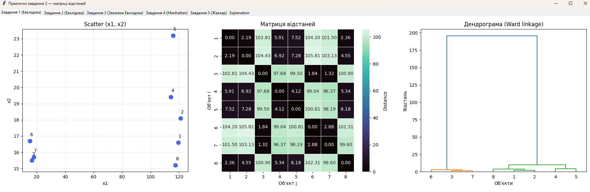
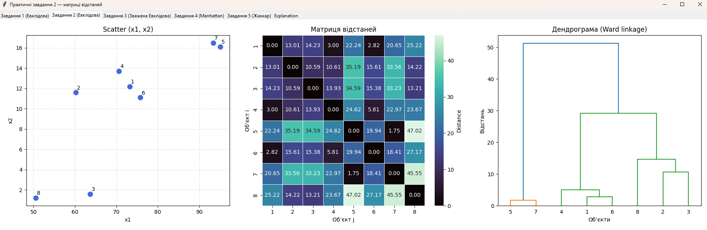
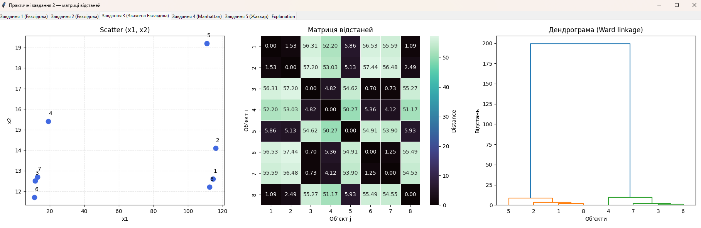
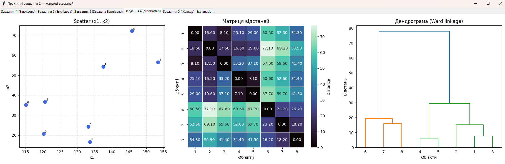
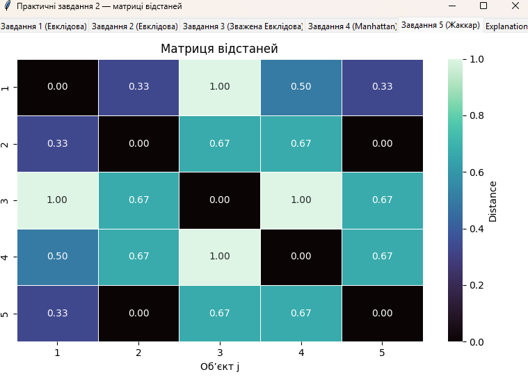
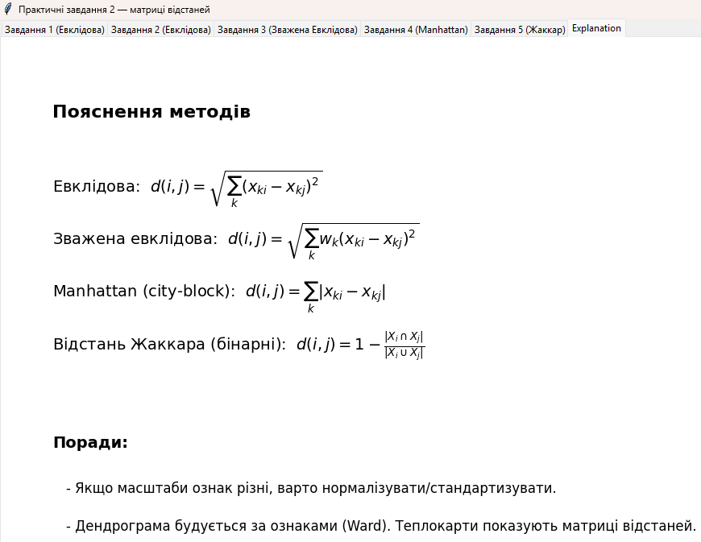

# Practical 2 — Distance Matrices GUI

Цей проєкт реалізує **усі п’ять завдань практичної роботи №2**.  
Програма об’єднує різні метрики відстаней і візуалізації в одному зручному графічному інтерфейсі (Tkinter + Matplotlib + Seaborn).

## 📌 Завдання
1. **Евклідова відстань** (табл. 2.10)  
2. **Евклідова відстань** (табл. 2.11)  
3. **Зважена евклідова відстань** (табл. 2.12, w1 = 0.3, w2 = 0.7)  
4. **City‑block (мангеттенська) відстань** (табл. 2.13)  
5. **Відстань Жаккара** для бінарних ознак (табл. 2.14)

## ⚙️ Функціонал
- Вкладки для кожного завдання.
- На кожній вкладці:
  - **Scatter plot** (для числових даних) з підписами об’єктів.
  - **Heatmap** матриці відстаней з підписами.
  - **Дендрограма** ієрархічної кластеризації (Ward linkage).
- Для завдання 5 (Жаккар) відображається лише теплокарта.
- Окрема вкладка **Explanation** з формулами та короткими поясненнями.

## 📸 Screenshots

### Завдання 1 — Евклідова відстань


### Завдання 2 — Евклідова відстань


### Завдання 3 — Зважена Евклідова


### Завдання 4 — Manhattan


### Завдання 5 — Жаккар


### Вкладка Explanation



## 🛠 Використані бібліотеки
- `tkinter` — графічний інтерфейс
- `matplotlib` — побудова графіків
- `seaborn` — теплокарти
- `pandas` — робота з таблицями
- `numpy` — обчислення
- `scipy.cluster.hierarchy` — дендрограми

## 🚀 Запуск
1. Клонувати репозиторій:
   ```bash
   git clone https://github.com/your-username/practical2-distance-matrices.git
   cd practical2-distance-matrices
   ```
2. Встановити залежності:
   ```bash
   pip install -r requirements.txt
   ```
3. Запустити програму:
   ```bash
   python Python.py
   ```
## 🎯 Висновки
Програма дозволяє наочно порівняти різні метрики відстаней, побачити групи схожих об’єктів і зрозуміти, як вибір метрики впливає на результат кластеризації.

